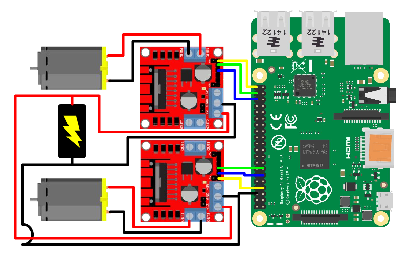

# bot-controller

Parts for the build

• <a href="https://www.amazon.com/Raspberry-Model-2019-Quad-Bluetooth/dp/B07TD42S27">1 X Raspberry Pi (model 3 or 4)</a> 
• <a href="https://www.amazon.com/SanDisk-Class-UHS-I-Memory-SDSDUNC-016G-GN6IN/dp/B0143RTB1E">1 X SD Card</a> 
• <a href="https://www.amazon.com/Qunqi-2Packs-Controller-Stepper-Arduino/dp/B01M29YK5U">2 X L298N Motor Drivers</a> 
• <a href="https://hobbyking.com/en_us/540-6527-brushed-motor-90w.html">2 X 12v Brushed DC Motor</a> 
• <a href="https://www.amazon.com/XOOL-Assortment-Precise-Beautiful-Printed/dp/B072FKMYMF">24 X 3 M 10mm Bolts</a> 
• <a href="https://www.amazon.com/Swpeet-Stainless-Assortment-Perfect-Washers/dp/B07VPDZ2KJ">24 X 3 M Lock Nuts</a> 
• <a href="https://www.shapeways.com/">Access To A 3d Printer</a> 
•  

Pinout  

  

Installation Instruction  
• Download Raspbian Disk Image 
• <a href="">Clone This Repo to Raspberry Pi Desktop</a> 
• sudo apt-get install nodejs 